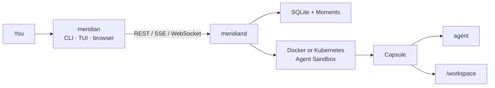

# Meridian

**Run Claude Code, Codex, OpenCode, or Pi in disposable workspaces on your own
machine, then review, rewind, and ship what they built.**

[](https://github.com/OrlojHQ/meridian/actions/workflows/ci.yml)
[](https://github.com/OrlojHQ/meridian/releases)
[](LICENSE)

Coding agents do their best work when you let them run: install packages, run
the test suite, rewrite half the repo. That is exactly what you don't want
happening in your only checkout, on your laptop, one attempt at a time.

Meridian gives every agent session its own **Capsule**: a throwaway container
with a fresh clone of your repository at `/workspace` and the agent you picked
already installed. Watch it work from the browser or your terminal, review the
diff, snapshot or fork the workspace to try another approach, and when you like
the result, open a pull request or pull the changes into your local checkout.
When you don't, throw it away.

Meridian is self-hosted and brings no model of its own. You sign in to the
agent exactly as you do today.

## Why Meridian

- **Let agents run without risking your machine.** Each Capsule is a non-root
  container with bounded CPU, memory, and process count. It never receives your Docker
  socket, your home directory, or Meridian's own credentials.
- **Keep the agent you already use.** Official images for Claude Code, Codex,
  OpenCode, and Pi. Import your existing configuration, skills, and plugins
  with **Import my setup**; login caches and history stay behind.
- **Snapshot, fork, and rewind.** Capture a **Moment** of the workspace at any
  point. Shard it into a new Capsule to try a different approach in parallel,
  or rewind to an earlier Moment without losing anything that came after.
- **Review before anything leaves the box.** A browser workspace with
  syntax-highlighted diffs, a file browser, a live terminal, and authenticated
  previews of dev servers running inside the Capsule.
- **Ship on your terms.** Push a reviewed branch and open a GitHub pull
  request, or sync the changes into an existing local checkout. Approval is
  bound to the exact tree you reviewed.
- **Start fast the second time.** Prepared environments cache your project's
  setup step, so the next Capsule on the same commit skips the reinstall.
- **Script everything.** Every UI action is also a CLI command and a
  documented [OpenAPI](api/openapi.yaml) endpoint.

## Quick start

You need Docker. Then pick an install path.

### From a release

Download the archive for your platform from
[Releases](https://github.com/OrlojHQ/meridian/releases) (`macOS` or `linux`,
`arm64` or `amd64`) and [verify it](docs/operations.md#verify-a-release):

```console
VERSION=0.1.1
curl -fsSLO "https://github.com/OrlojHQ/meridian/releases/download/v${VERSION}/meridian_${VERSION}_macOS_arm64.tar.gz"
tar -xzf "meridian_${VERSION}_macOS_arm64.tar.gz" meridian meridiand
```

Start the daemon, then open the dashboard in a second terminal:

```console
./meridiand --provider=docker
./meridian tui --harness claude
```

Enter a repository (`owner/repo` or a clone URL) and submit. Meridian pulls
the Claude Code image, starts a Capsule, and hands you its terminal.
Sign in there. The browser workspace is at
[http://127.0.0.1:8080/ui/](http://127.0.0.1:8080/ui/).

Swap `--harness claude` for `codex`, `opencode`, or `pi`.

### From source

You need Go 1.26.5, Bun 1.3.0, Git, Make, and Docker with BuildKit.

```console
make bootstrap
make try-claude
```

That builds everything, starts `meridiand` on loopback, and opens the same
dashboard. Also available: `make try-codex`, `make try-opencode`,
`make try-pi`.

### Troubleshooting

- **`cannot reach Docker`**: start Docker (Docker Desktop, OrbStack, or the
  Docker service). On Linux, your user needs access to the Docker socket. Use
  `--docker-host` to point at a different engine.
- **Port 8080 is already in use**: pick other ports and point the CLI at them:

  ```console
  ./meridiand --provider=docker --listen=127.0.0.1:18080 --preview-listen=127.0.0.1:18081
  ./meridian --server http://127.0.0.1:18080 tui --harness claude
  ```

  The browser workspace is then at `http://127.0.0.1:18080/ui/`.
- **macOS says `meridiand` cannot be opened**: the binaries are not notarized,
  and archives downloaded in a browser are quarantined. After
  [verifying the archive](docs/operations.md#verify-a-release), run
  `xattr -d com.apple.quarantine meridian meridiand`. Downloads made with
  `curl`, as above, are not quarantined.

## Supported agents

| Agent | Image | Terminal | Browser threads |
| --- | --- | :---: | :---: |
| Claude Code | `ghcr.io/orlojhq/meridian-capsule-claude` | ✓ | |
| Codex | `ghcr.io/orlojhq/meridian-capsule-codex` | ✓ | |
| OpenCode | `ghcr.io/orlojhq/meridian-capsule-opencode` | ✓ | ✓ |
| Pi | `ghcr.io/orlojhq/meridian-capsule-pi` | ✓ | ✓ |

Every image pins its agent release by checksum, is built for `amd64` and
`arm64`, and is signed with Sigstore on each release. Browser threads are
structured, encrypted conversations you can follow and answer from the web UI.
Any other CLI agent can run as a custom harness through
[`.meridian/project.yaml`](docs/harness-configuration.md).

## How it works



| Piece | Role |
| --- | --- |
| `meridiand` | Daemon: API, storage, Capsule lifecycle, embedded web UI |
| `meridian` | CLI and terminal dashboard |
| Capsule | Container with `capsuled` (a small supervisor) and one agent |

You run one daemon. It starts Capsules on local Docker or, for a cluster, on
[Kubernetes Agent Sandbox](docs/kubernetes-agentsandbox.md), and stores
Moments next to its SQLite database.

## Security model

Meridian treats repositories, agent output, terminals, and Capsule processes as
hostile.

- The API listens on loopback by default and requires an installation token.
- Only `meridiand` touches the Docker socket; Capsules never get it, host
  paths, or control-plane credentials.
- Secrets are encrypted at rest and scoped to a purpose, such as one clone or
  one pull request.
- Structured transcripts are encrypted at rest.

Meridian is built for **one trusted person** running agents on their own
machine or cluster. Docker containers are not a boundary between mutually
hostile tenants, so do not host Meridian for untrusted users. Read the
[threat model](docs/threat-model.md) and [security policy](SECURITY.md).

## Status

Meridian is pre-1.0. APIs and on-disk formats may change between minor
releases; see the [changelog](CHANGELOG.md).

## Documentation

**Use**
- [CLI and terminal dashboard](docs/cli-and-tui.md): `thread spawn`, sync,
  ship
- [Browser workspace and previews](docs/review-ui.md)
- [Bring your harness setup](docs/personal-harness-setups.md)
- [Prepared project environments](docs/prepared-environments.md)
- [Moments and lineage](docs/moments-and-lineage.md): capture, shard, rewind,
  seal

**Extend**
- [Harness configuration](docs/harness-configuration.md): `.meridian/project.yaml`
- [Harness adapters](docs/harness-adapters.md): official images and the
  structured protocol

**Operate**
- [Operations](docs/operations.md): install, verify, back up, Compose, Helm
- [Docker development](docs/docker-development.md)
- [Kubernetes Agent Sandbox](docs/kubernetes-agentsandbox.md)
- [Threat model](docs/threat-model.md)

## Contributing

Issues and pull requests are welcome. Start with
[CONTRIBUTING.md](CONTRIBUTING.md), and discuss large changes in an issue
first.

```console
make bootstrap
make build test lint ui-build helm-test
```

## License

[Apache License 2.0](LICENSE). Meridian is developed by
[OrlojHQ](https://github.com/OrlojHQ) and is independent of
[Orloj](https://github.com/OrlojHQ/orloj).
