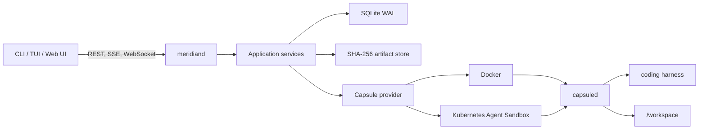

# Meridian

Meridian is a self-hosted control plane for disposable, resumable coding
workspaces. It creates isolated development environments, runs the coding
harness you choose, streams its terminal and events, and lets you review or
branch the resulting filesystem state.

Meridian manages the workspace around a coding agent. It does not provide a
model, choose tools, interpret model output, or implement an agent loop.

> [!IMPORTANT]
> Meridian is currently a source-complete pre-release with no published stable
> release. The local Docker provider is for one trusted user and is not a
> hostile multi-tenant isolation boundary. The API requires the installation
> bearer token, but should still remain on loopback unless an operator supplies
> TLS and an independently reviewed network boundary.

## What you can do today

With Meridian you can:

- create a **Capsule** from a public Git repository;
- run any executable described by the repository's harness configuration;
- attach to an interactive PTY and reconnect without losing bounded output;
- stream ordered Run events and inspect Git status or unified diffs;
- browse bounded workspace files, safely sync a reviewed workspace into a
  matching local Git worktree, and ship an approved exact Git state;
- retain encrypted structured agent Threads with typed messages, tool summaries,
  permission responses, and resumable sessions;
- open a terminal dashboard or browser-based review interface;
- expose a Capsule's local web server through a short-lived loopback preview;
- capture an immutable filesystem **Moment**;
- create independent **Shards** from a Moment;
- **Rewind** by branching from earlier state without deleting later history;
- **Seal** a Capsule into an immutable final state;
- pause, resume, recover, and clean up provider resources after daemon restarts;
- back up, verify, restore, and garbage-collect local metadata and artifacts;
- run Capsules locally with Docker or in Kubernetes with Agent Sandbox.

The complete local workflow is implemented for Docker. Kubernetes Agent
Sandbox supports lifecycle, Run, Git, and PTY operations; Kubernetes Moments
and previews are intentionally unsupported until they can preserve the same
safety semantics.

## Core concepts

- **Project** — repository, Capsule image, and executable setup configuration.
- **Capsule** — one provider-backed coding workspace with persistent
  `/workspace` storage.
- **Harness** — an arbitrary executable profile supplied by the repository.
- **Run** — one durable invocation of a configured harness.
- **Moment** — an immutable snapshot of `/workspace` plus an environment
  manifest. It does not include RAM or running processes.
- **Timeline** — the ordered lineage of a Capsule and its Moments.
- **Shard** — a new writable Capsule and Timeline created from a Moment.
- **Rewind** — a non-destructive Shard from an earlier Moment.
- **Seal** — capture a final Moment and permanently block further mutation.
- **Delivery** — a durable, explicitly approved exact-ref push, optionally
  followed by a host-side GitHub pull request.

## Five-minute local demo

### Prerequisites

- Go 1.26.5
- Bun 1.3.0
- Git and Make
- Docker with BuildKit

Bootstrap the repository and build the binaries:

```console
make bootstrap
make build
```

For a deterministic first run, build the demo Capsule image. It contains a
fixture Git repository and credential-free mock harnesses:

```console
make capsule-integration-image
```

Start the Docker-backed control plane:

```console
./bin/meridiand \
  --provider=docker \
  --data-dir=/tmp/meridian-demo \
  --docker-image=meridian-capsule-integration:dev
```

In another terminal, create a Project:

```console
./bin/meridian project create demo \
  --repository-url=file:///fixture \
  --image=meridian-capsule-integration:dev \
  --harness-image=mock=meridian-capsule-integration:dev

./bin/meridian project list
```

Start a project session with one action. Meridian durably encrypts the first
prompt, provisions a fresh Capsule and Timeline asynchronously, then creates
and starts the Thread when the Capsule is Ready:

```console
printf '%s' 'inspect the fixture' | ./bin/meridian thread spawn PROJECT_ID \
  --harness mock-structured \
  --prompt-stdin \
  --name workspace \
  --follow

./bin/meridian thread get THREAD_ID

printf '%s' 'second turn' | ./bin/meridian thread send THREAD_ID \
  --expected-version=RESOURCE_VERSION \
  --prompt-stdin
```

The mock's `permission...` and `input...` messages exercise explicit response
controls without credentials. Use `thread respond`, `thread cancel`,
`thread archive`, and the explicitly confirmed `thread delete` crypto-shred
operation for the remaining lifecycle.
`capsule create` and Capsule-scoped `thread create` remain available for
power-user workflows that intentionally assemble those resources separately.

The image also includes the native deterministic Run harness:

```console
./bin/meridian run start \
  --capsule CAPSULE_ID \
  --harness mock-jsonl \
  --prompt "update the fixture"

./bin/meridian run list --capsule CAPSULE_ID
./bin/meridian run events RUN_ID --after 0
./bin/meridian capsule git-status CAPSULE_ID
./bin/meridian capsule diff CAPSULE_ID
./bin/meridian capsule files list CAPSULE_ID
./bin/meridian capsule files read CAPSULE_ID README.md
```

To bring the reviewed workspace into an existing matching Git worktree, inspect
the printed Capsule status/diff and run:

```console
./bin/meridian capsule sync CAPSULE_ID --to /path/to/worktree
# Explicitly mirror non-Git content, including deletions:
./bin/meridian capsule sync CAPSULE_ID --to /path/to/worktree --force
```

Sync never writes or removes `.git` or `.meridian-prepared`. The default mode
requires a clean target and refuses replacement conflicts; `--force` still
rejects traversal, special files, and symlink escapes.

Delivery Projects name separate `git_push` and `github_api` secrets and commit
identity; secret plaintext is never Project configuration. After reviewing the
status, diff, HEAD, and tree, ship only a non-protected branch:

```console
./bin/meridian capsule ship CAPSULE_ID \
  --branch feature/reviewed \
  --commit-message "Ship reviewed changes" \
  --open-pull-request --title "Reviewed changes" --base main --yes
```

`--yes` is mandatory and binds the request to the freshly inspected Capsule
resource version, HEAD, and tree. Meridian refuses `main`, `master`, `trunk`,
the discovered/configured default destination, tags, deletion, wildcard, and
force pushes.

The demo image also includes an interactive harness:

```console
./bin/meridian run start \
  --capsule CAPSULE_ID \
  --harness mock-pty \
  --prompt "interactive demo"

./bin/meridian run attach RUN_ID
```

Press `Ctrl-P`, release it, then press `Ctrl-Q` to detach locally. `Ctrl-\` and
`Ctrl-]` are alternatives. `Ctrl-C` is sent to the remote PTY. Meridian sets a
best-effort local terminal title during attachment, keeps it after harness
output frames, and restores the Project title afterward;
set `MERIDIAN_TERMINAL_TITLE=0` to disable that metadata.

Open the terminal dashboard:

```console
./bin/meridian tui
```

Or open the embedded review UI at
[http://127.0.0.1:8080/ui/](http://127.0.0.1:8080/ui/).

All commands support `--json` for automation and `--server` for selecting the
daemon:

```console
./bin/meridian --json capsule list PROJECT_ID
```

## Filesystem history

Docker Capsules support immutable filesystem history:

```console
./bin/meridian moment capture CAPSULE_ID checkpoint \
  --expected-version=RESOURCE_VERSION

./bin/meridian moment list CAPSULE_ID
./bin/meridian timeline get TIMELINE_ID
./bin/meridian shard create --from MOMENT_ID --name experiment
./bin/meridian rewind CAPSULE_ID --to MOMENT_ID --name recovered
./bin/meridian seal CAPSULE_ID --expected-version=RESOURCE_VERSION
```

Shard and Rewind create new Capsules and Timelines. They never overwrite the
source workspace or destroy later history. Moment archives are content
addressed, verified on restore, and reject unsafe paths, special files, and
archive expansion abuse.

See [Moments and lineage](docs/moments-and-lineage.md) for exact semantics.

## Running your own repository and harness

A Project points at a public repository and a Meridian-compatible Capsule
image:

```console
cd /path/to/project
./bin/meridian project create \
  --image=example/meridian-project@sha256:... \
  --setup-arg=/usr/bin/make \
  --setup-arg=bootstrap
```

When run inside a Git worktree, `project create` uses the directory name and
`origin` by default. GitHub SSH origins are converted to cloneable HTTPS URLs.
An explicit name or repository still overrides discovery:

```console
./bin/meridian project create my-project \
  --repository-url=https://github.com/example/project.git \
  --image=example/meridian-project@sha256:... \
  --setup-arg=/usr/bin/make \
  --setup-arg=bootstrap
```

Each `--setup-arg` is a separate executable argument; Meridian never joins
setup values into a shell command. `--repository-url=owner/repository` expands
GitHub shorthand. Pass an explicit empty `--repository-url=` to create a
Project without discovering the current worktree.

The repository defines harnesses in `.meridian/project.yaml`:

```yaml
version: v1
harnesses:
  - name: coding-agent
    executable: /usr/local/bin/coding-agent
    arguments: ["--format=jsonl"]
    workingDirectory: .
    promptMode: stdin
    pty: false
    outputMode: jsonl
    timeout: 30m
    secretReferences: []
```

Harnesses are direct executable invocations, not shell strings. Prompt modes
are `argument`, `stdin`, or `interactive`; interactive harnesses require a
PTY. The selected Capsule image must contain `capsuled`, the harness executable,
and the project toolchain.

Profiles may instead opt into a non-PTY `structured` interaction and launch a
generic executable that speaks the private bounded `meridian.adapter.v1`
protocol. Docker and Agent Sandbox carry that transport without exposing their
runtime APIs to clients. The public Thread API, encrypted transcript clients,
deterministic mock adapter, OpenCode server adapter, and Pi RPC adapter all use
the same typed protocol. The terminal dashboard instead launches and attaches
the selected harness's native PTY TUI.

An optional in-repo image installs a pinned OpenCode binary on the thin
Capsule base:

```console
make capsule-opencode-image
# tag: meridian-capsule-opencode:dev
# trusted profile: /etc/meridian/harnesses.d/opencode.yaml
```

Project images can install OpenCode or Pi the same way and select the packaged
bridge:

```yaml
adapter:
  protocol: meridian.adapter.v1
  executable: /usr/local/bin/meridian-harness-adapter
  arguments: ["opencode-server", "--", "/usr/local/bin/opencode"]
# Pi: ["pi-rpc", "--session-dir", "/home/capsule/.pi-sessions", "--", "/usr/local/bin/pi"]
```

Meridian does not install these harnesses or model providers. Operators store
purpose-scoped values with `meridian secret put NAME --purpose ... --stdin`;
values are encrypted under the separate installation credential key and are
never returned. A Project must explicitly authorize a `git_https` name with
`--git-secret` or `harness_env` names with repeated `--harness-secret` flags.
Repository YAML can reference only those authorized harness names. Private
HTTPS clone uses a one-shot private askpass grant, and native and structured
harnesses receive exactly their referenced environment values for process
startup. See [Harness
configuration](docs/harness-configuration.md) and [structured adapter
guidance](docs/harness-adapters.md).

## User interfaces

Meridian exposes the same control plane through three clients:

- **CLI** — scriptable lifecycle, Run, Git, Moment, lineage, and maintenance
  commands with stable `--json` output.
- **TUI** — a Project/Capsule launcher that creates a harness-selected Capsule
  and hands the terminal to its native PTY TUI. Existing encrypted Thread
  history and lifecycle actions remain available from the command palette.
- **Web UI** — Capsule, Thread, and Run review; resumable SSE Thread timelines;
  bounded text-only diffs; separate xterm.js terminal attachment; Moments; and
  Timeline lineage.

The web UI is served from `/ui/`. Docker previews use a separate listener on
`127.0.0.1:8081`: URLs are random, short-lived, scoped to one Capsule and port,
and retained in daemon memory only as digests.

See [CLI and TUI](docs/cli-and-tui.md) and
[Review UI and previews](docs/review-ui.md).

## Architecture



The three binaries are:

- `meridiand` — API server, reconciliation, storage, provider lifecycle,
  event delivery, previews, metrics, and embedded web assets.
- `meridian` — CLI, TUI, native PTY attach, and offline maintenance.
- `capsuled` — non-root authenticated supervisor inside each Capsule.

`api/openapi.yaml` is the public contract. Go and TypeScript clients are
generated into `pkg/client` and `frontend/src/api/generated`.

## Providers

| Capability | Fake | Docker | Agent Sandbox |
| --- | --- | --- | --- |
| Lifecycle simulation | Yes | — | — |
| Real workspace | No | Yes | Yes |
| Pause and resume | Simulated | Yes | Yes |
| Run, Git, PTY | No | Yes | Yes |
| Private structured adapter runtime | No | Yes | Yes |
| HTTP/WebSocket preview | No | Yes | No |
| Moment and Shard | No | Yes | No |
| Intended use | Tests | Trusted local development | Self-hosted Kubernetes |

The fake provider creates no process, filesystem, machine, or security
boundary.

The Agent Sandbox provider uses `agents.x-k8s.io/v1beta1`, persistent workspace
PVCs, owned Secrets, and private per-operation port forwarding. Agent Sandbox
orchestrates Pods; it does not itself provide workload isolation. A hostile
deployment requires a separately validated gVisor or Kata `RuntimeClass`,
NetworkPolicy enforcement, namespace controls, and external security review.

See [Docker development](docs/docker-development.md) and
[Agent Sandbox operations](docs/kubernetes-agentsandbox.md).

## Persistence, backup, and observability

Local state consists of SQLite in WAL mode and a SHA-256 content-addressed
artifact store. Stop `meridiand` before offline maintenance:

```console
./bin/meridian --json admin backup create \
  --data-dir=/var/lib/meridian \
  --output=/backup/meridian

./bin/meridian admin backup verify --backup=/backup/meridian
./bin/meridian admin restore \
  --backup=/backup/meridian \
  --data-dir=/var/lib/meridian-restored

./bin/meridian admin cas verify --data-dir=/var/lib/meridian
./bin/meridian admin cas gc --data-dir=/var/lib/meridian
./bin/meridian admin transcript-key rotate \
  --data-dir=/var/lib/meridian --yes
```

CAS garbage collection is a dry run unless deletion is explicitly requested.
Backups contain credential ciphertext but no credential plaintext and
deliberately exclude both installation transcript and credential keys. The
manifest records required key IDs and versions. Restore requires separately
protected matching keys (`--transcript-key-file` and `--secret-key-file`);
key loss is unrecoverable.
Transcript-key rotation is coordinated and offline: stop the daemon, use the
command above to transactionally re-wrap every retained non-deleted Thread and
pending Project Thread intent, then create and deep-verify a fresh backup. The
command never prints key material.

Thread message/start/respond mutations are client-idempotent. After an
ambiguous failure, retry with the same idempotency key: one pending persisted
message may be delivered, while an acknowledged replay never resends. Daemon
recovery reconciles sessions but does not auto-send messages. Bounded adapter
metadata is retained only in the encrypted transcript payload.

Prometheus metrics and OTLP/HTTP tracing are optional and disabled by default:

```console
./bin/meridiand \
  --metrics-listen=127.0.0.1:9090 \
  --otel-otlp-endpoint=127.0.0.1:4318
```

Observability deliberately excludes prompts, repository names, paths, diffs,
PTY bytes, tokens, and resource IDs.

See [Release and operations](docs/operations.md).

## Security model

Meridian treats repositories, dependencies, setup scripts, harnesses, diffs,
terminal output, previews, and Capsule processes as hostile inputs.

Important boundaries:

- the public API requires one installation bearer principal and defaults to a
  loopback listener;
- only `meridiand` can access the host Docker socket;
- Capsules never receive the Docker socket, host paths, provider credentials,
  or control-plane state;
- Docker is not an untrusted multi-tenant isolation boundary;
- `capsuled` runs as UID/GID 10001 with bounded authenticated protocols;
- attach and preview tickets are short-lived and narrowly scoped;
- normal logs, events, metrics, and traces exclude prompts and content;
- structured transcripts are encrypted at rest, but the local daemon decrypts
  them for the trusted local user through explicit Thread APIs;
- Moments contain filesystem state and may contain repository secrets;
- hosted multi-tenancy is explicitly unsupported.

Read [the threat model](docs/threat-model.md) and
[security policy](SECURITY.md) before exposing or extending Meridian.

## Development

Common checks:

```console
make bootstrap
make build
make test
make lint
make ui-test
make ui-build
make helm-test
make docker-integration
make release-check
```

Generated clients must stay synchronized:

```console
make generate
make check-generated
```

Additional opt-in targets include `make agentsandbox-integration`,
`make release-snapshot`, and `make release-docker-validate`.

## Repository layout

```text
api/                              OpenAPI source contract
cmd/                              meridian, meridiand, and capsuled
frontend/                         React review UI and generated TS client
internal/app/                     provider-independent use cases
internal/domain/                  lifecycle state and invariants
internal/provider/docker/         trusted-local Docker provider
internal/provider/agentsandbox/   Kubernetes Agent Sandbox provider
internal/capsuleproto/            private supervisor protocol
internal/store/sqlite/            transactional metadata store
internal/artifacts/               immutable content-addressed storage
internal/tui/                     Bubble Tea dashboard
internal/webui/                   embedded production web assets
deploy/helm/meridian/             hardened Kubernetes deployment chart
docs/                             operations, security, and architecture
testing/                          deterministic harnesses and integration tools
```

## Scope

Meridian is coding-workspace infrastructure. It is not:

- a model API or coding agent;
- a multi-agent planner or general workflow engine;
- a memory or process snapshot system;
- a hosted collaboration, billing, or RBAC platform;
- a secure public preview service; or
- a claim that containers alone safely isolate mutually hostile tenants.

Meridian is independent from
[Orloj](https://github.com/OrlojHQ/orloj), which is a runtime and control plane
for durable agentic systems.

## License

Apache License 2.0. See [LICENSE](LICENSE).
