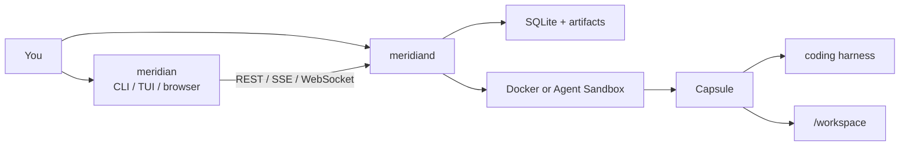

# Meridian

Self-hosted disposable coding workspaces.

[Apache-2.0](LICENSE) · pre-release · [Contributing](CONTRIBUTING.md) · [Security](SECURITY.md)

Meridian gives a coding agent a disposable workspace you run yourself. Point it
at a repository, pick OpenCode, Claude, Codex, or Pi, and review or branch the
filesystem when you are done.

Each workspace is a **Capsule**: a short-lived environment with the **harness**
you chose attached to `/workspace`. Meridian starts that Capsule, keeps the
terminal and review surfaces in front of you, and leaves the agent loop and
sign-in inside the harness. It does not provide a model or pick the agent's
tools.

You can:

- Start a workspace from a public repo in the browser or the terminal dashboard
- Attach the harness you already use; sign-in stays there
- Review diffs, browse files, and keep a terminal on the workspace
- Snapshot and branch the filesystem (Moments) instead of throwing the machine
  away

## Try it

You need Go 1.26.5, Bun 1.3.0, Git, Make, and Docker with BuildKit.

```console
make bootstrap
make try-opencode
```

That builds the CLI, builds `meridian-capsule-opencode:dev`, starts `meridiand`
on loopback if it is not already up, and opens the dashboard on New Project.
Enter a public repository (`owner/repo` or a clone URL) and submit. Meridian
creates a Capsule and hands the terminal to OpenCode. Sign in there.

Same path for the other official packs: `make try-pi`, `make try-claude`,
`make try-codex`.

If the daemon is already running:

```console
export MERIDIAN_TOKEN_FILE=.local/meridian-data/api-auth/installation.token
./bin/meridian tui --harness opencode
```

The browser UI is [http://127.0.0.1:8080/ui/](http://127.0.0.1:8080/ui/).

## How it works

You run a local daemon and talk to it from the CLI, the terminal dashboard, or
the embedded browser UI. The daemon creates a Capsule through Docker (local)
or Agent Sandbox (Kubernetes), attaches one harness, and stores workspace
artifacts next to its SQLite database.

| Piece | Role |
| --- | --- |
| `meridiand` | Control plane: API, storage, Capsule lifecycle, embedded web UI |
| `meridian` | CLI and terminal dashboard; talks to that daemon |
| Capsule image | `capsuled` plus one harness (`opencode`, `pi`, `claude`, `codex`, or your own) |



Until you install a release, build from this repo. Published images, Compose,
and Helm are in [operations](docs/operations.md). Official packs and the
structured protocol are in [harness adapters](docs/harness-adapters.md). Docker
is the complete local path; Agent Sandbox is the Kubernetes option — see
[Docker development](docs/docker-development.md) and
[Agent Sandbox](docs/kubernetes-agentsandbox.md).

## Status

> [!IMPORTANT]
> Pre-release: there is no published stable version yet. You operate
> `meridiand` and `meridian` yourself. The Docker provider is for one trusted
> user and is not a hostile multi-tenant boundary. Keep the API on loopback
> unless you supply TLS and a reviewed network edge.

## Docs

**Start here**

- [CLI and TUI](docs/cli-and-tui.md) — dashboard, `thread spawn`, sync, ship
- [Review UI and previews](docs/review-ui.md)
- [Harness configuration](docs/harness-configuration.md) — `.meridian/project.yaml`

**Go deeper**

- [Harness adapters](docs/harness-adapters.md) — official packs and structured protocol
- [Personal harness setups](docs/personal-harness-setups.md) — import configuration and reusable API connections
- [Prepared project environments](docs/prepared-environments.md) — reuse project dependencies between Capsules
- [Moments and lineage](docs/moments-and-lineage.md) — capture, shard, rewind, seal

**Operate and secure**

- [Docker development](docs/docker-development.md) — local provider, dev Compose, mock image
- [Agent Sandbox](docs/kubernetes-agentsandbox.md)
- [Operations](docs/operations.md) — install, backup, verify, Helm
- [Threat model](docs/threat-model.md)

## Security

Treat repositories, harness output, terminals, and Capsule processes as hostile.

- One installation bearer; API defaults to loopback
- Only `meridiand` may use the host Docker socket
- Capsules never receive that socket, host paths, or control-plane credentials
- Docker does not isolate mutually hostile tenants
- Structured transcripts are encrypted at rest; the local daemon decrypts them
  for the operator through explicit Thread APIs
- Hosted multi-tenancy is unsupported

See the [threat model](docs/threat-model.md) and [security policy](SECURITY.md).

## Development

```console
make bootstrap
make build
make test
make lint
make ui-build
make helm-test
```

`make generate` then `make check-generated` after `api/openapi.yaml` changes.
`pkg/client` and `frontend/src/api/generated` are generated; do not edit them.

```text
api/           OpenAPI contract
cmd/           meridian, meridiand, capsuled
deploy/        Compose and Helm
docs/          operations, security, ADRs
images/        thin Capsule and official pack Dockerfiles
internal/      control plane, providers, TUI
```

## License

Apache License 2.0. See [LICENSE](LICENSE).

Meridian is coding-workspace infrastructure, independent from
[Orloj](https://github.com/OrlojHQ/orloj), a runtime for durable agentic
systems. It is not a model API, an agent, a planner, a hosted collaboration
product, or a claim that containers isolate hostile tenants.
